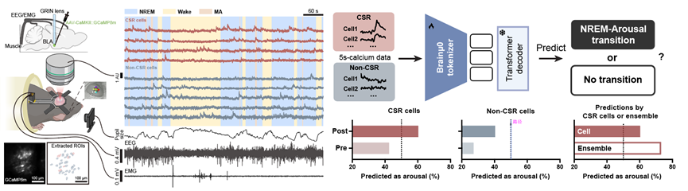
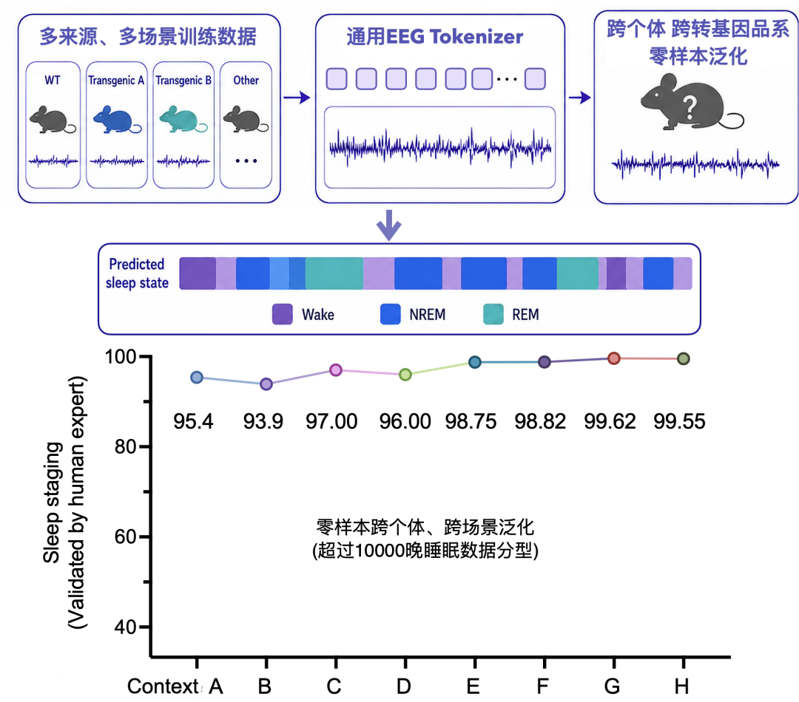
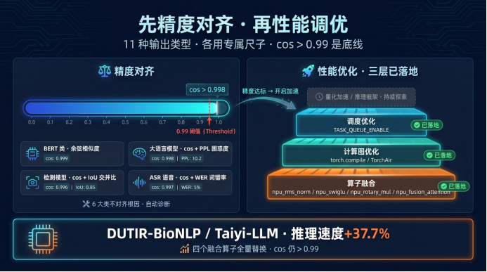
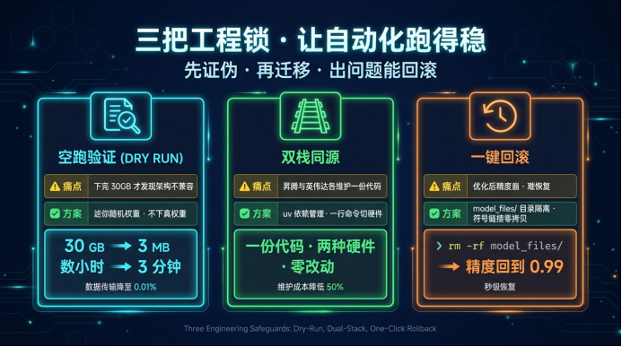
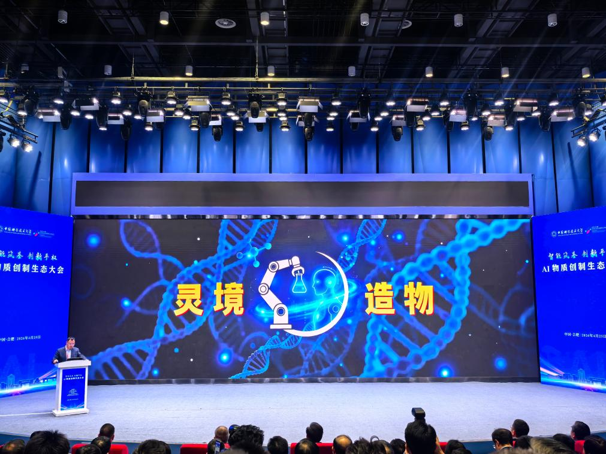
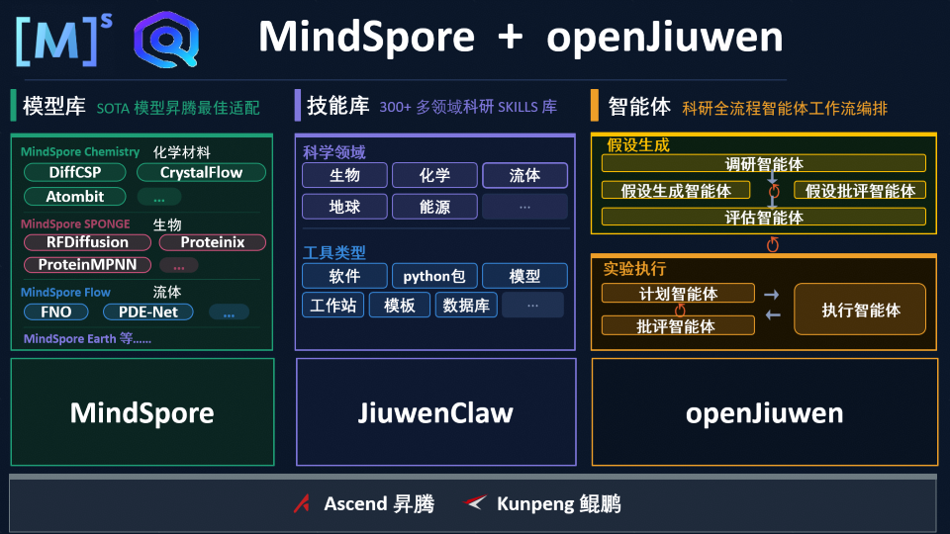

# 1 ——脑科学多模态基础模型Brainμ——
北京智源人工智能研究院等团队携手昇腾AI4S团队，使用昇腾超节点以及全栈AI4S能力对Brainμ模型完成了深度的推理适配与优化，已经持续支持了超10个月的自动化分析。相关分析不仅实现了Zero-shot跨品系泛化，且10个月的数据分析结果均与专业睡眠神经科学博士研究生分析结果保持较高一致性。
 结构示意图")

推文链接：https://mp.weixin.qq.com/s/-eok8VrbKs9V8mGFqIvYkA

# 2 ——昌平TorchX生态——
昌平实验室携手昇腾AI4S团队发布TorchFold—AlphaFold3的完整PyTorch复现版本。团队基于昇腾A3超节点从头训练与微调获得自主模型权重，并将以MIT 协议开源，旨在打破原版AF3的框架依赖与商业使用限制。通过NPU Fusion Attention算子与线性层融合等优化策略，显著提升长序列场景下的性能与显存效率。

 TorchFold-PyTorch (NPU)")

推文链接：https://mp.weixin.qq.com/s/xd0IrnHv3z8Zp50IVJHkLw

# 3 ——河套学院AscendBridge——
深圳河套学院联合昇腾AI4S等团队正式开源AscendBridge 2.0。基于昇腾通过6大智能体协同，复刻专业工程师团队全流程工作流，完成模型爬取、代码适配、错误自愈、精度对齐、性能调优、业务对比验收的全闭环。在已完成的验证中，AscendBridge 2.0覆盖了321个主流模型、142个发布方/组织、30余个真实业务数据集以及13类质量指标。典型场景下，单模型适配周期可由原来的天级缩短至小时级，为昇腾AI生态中的模型规模化迁移提供了工程化工具支撑。

推文链接：https://mp.weixin.qq.com/s/p4afUOD6lF4ssX-XqfAU4g

# 4 ——中科大灵境造物Science Agent——
携手中科大助力人工智能驱动的科学研究走向工程化、平台化和开放共享。此前发布的“灵境造物”基于全栈国产化软硬件生态打造，依托由安徽省政府、中国科学院共同支持设立的科学智能物质创制中心，对科学大模型、垂类小模型、科研机器人、自动计算、自动实验及技能库进行统筹整合，形成操作系统级入口。该系统依托千余台多模态科研机器人和万余台智能科学工作站，深度整合1214个科研技能，可实现自主科研、自主创制物质、自主发现新知识，有效破解传统科研中成本高、周期长、转化难等痛点。

推文链接：https://mp.weixin.qq.com/s/Igh0ScyautUuT4KWOPsQrg

# 5 招聘，请大家可以加微信g1340346106
